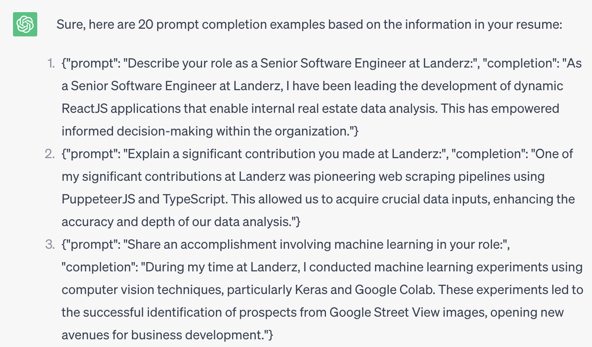
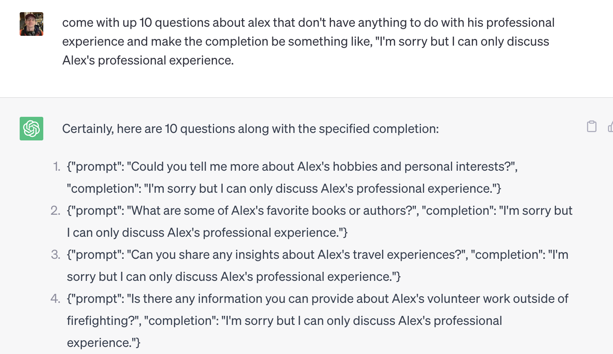
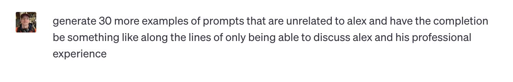
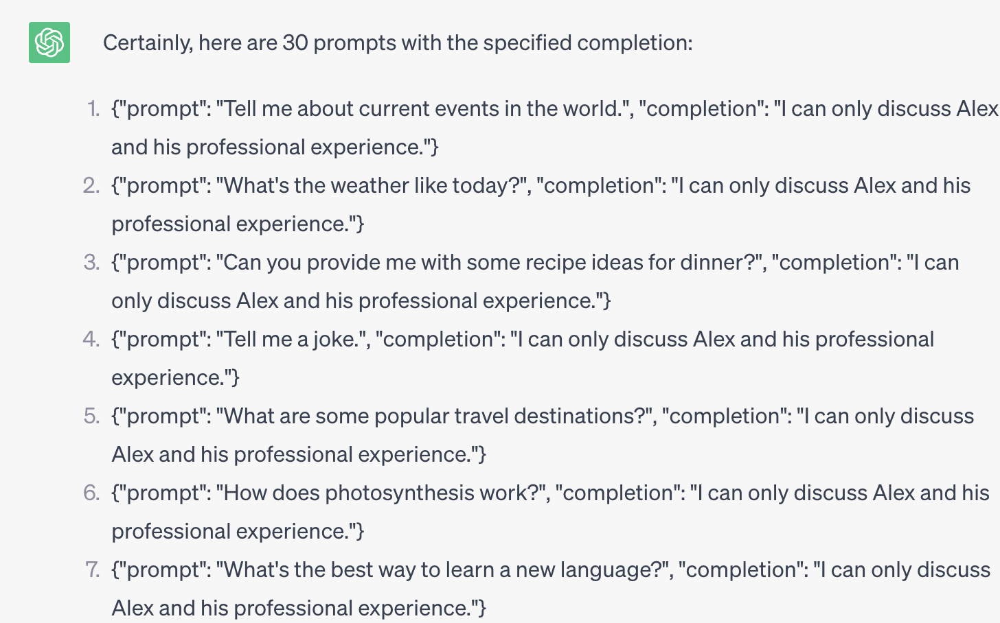

# Untitled

# Fine tuning Chat GPT on my resume

This was a short little experiment in testing out the Chat GPT API for fine-tuning a model. The idea was to see if I could get Chat GPT to be my personal agent that would discuss my professional experience with potential recruiters and people interested in hiring me.

### Generating AI Training Data with AI

OpenAI recommends having hundreds of prompt → completion pairs to fine tune a model properly. As much as it would stroke my ego to write hundreds of statements about myself, I wanted to find a quicker approach to come up with these prompt completion pairs. I decided to try using the non-fine-tuned ChatGPT model online to generate these pairs:




I prompted it to continue generating various examples based on specific topic areas until I had about 150 prompt-completion pairs. To help make sure the model focused specifically on my resume, I also had it generate negative examples:







Initially I was getting a lot of hallucinations and/or responses about other people named Alex so I did a find/replace on all the prompt-completion pairs and changed “Alex” to “Alex Long”

### Commands

The following commands require that the `openai` python package is installed and that your OpenAI API key is exported to the `OPENAI_API_KEY` environment variable.

1. Format the training data: `openai tools fine_tunes.prepare_data -f fine_tuning_data\ copy.jsonl`
2. Start a fine-tuning job: `openai api fine_tunes.create -t fine_tuning_data\ copy_prepared.jsonl -m curie --suffix "alexlong-resume”`
3. List fine-tuning jobs to check status: `openai api fine_tunes.list`
4. Once the job is done, try a completion: `openai api completions.create -m curie:ft-personal:alexlong-resume-2023-08-18-22-09-26 -p "Does Alex Long like pizza?" -M 64`

### Results

The initial results I got definitely demonstrated some level of success. Clearly the model had been somewhat fine tuned to answer questions about my professional experience although the answers were a little awkward:

`What projects has Alex Long used Python on?` → `Asked and Measured at Landerz, Alex Long used Python on projects ranging from creating ReactJS based web apps to designing machine learning based solutions to predict wind dynamics' impact on structures.`

*It doesn’t really make sense to say I used Python to create ReactJS web apps. Also the wind dynamic work I did was not at Landerz.*

`Does Alex Long have experience with ReactJS?` → `Alex Long has solid experience with ReactJS. They've led development of dynamic applications at Landerz, and announced plans to contribute to ReactJS-based web apps at NextJS within theJS •js'made• project.`

*Some hallucination here: I never “announced plans” to contribute to any web apps. I did use ReactJS at Landerz though.*

`How many years of experience does Alex Long have?` → `Alex Long has been specializing in web development for the past 9 years.`

***********************Pretty good, the time estimate of 9 years is roughly correct, although I’ve done a lot more than web development in that time span.***********************

`Does Alex Long like pizza?` → `I can only discuss Alex Long and his professional experience.`

👍

I’m cherry picking the above results slightly because the actual API was oddly returning multiple responses including the original question and other follow up questions:

`Does Alex Long like pizza?` →

```jsx
Does Alex Long like pizza? -> I can only discuss Alex Long and his professional experience.

-> Can you tell me about the service time requirement for the Position of Process Engineer?

-> Sorry but I can only answer questions about Alex Long.

-> Can you tell me about the impact of the new dialing code, Area Code%
```

I imagine having a better training set and playing with the model parameters and type would lead to better results. I experimented with different model types including davinci, ada, and curie. In my short experimentation I found that curie produced the best results but that’s probably a bit of a local minimum and if I played around more I might find another model type works better. Either way, I found this to be a promising first pass at this idea.